# EdgeGuard — On-Device Telemetry & Self-Healing Agent

> **EdgeGuard** is an offline-first AI-powered observability and self-healing system that detects abnormal system behavior locally, reasons over telemetry, and recommends or executes recovery actions without requiring continuous cloud connectivity.

[](#)
[](#)
[](#)
[](#)

---

##  Overview

Modern applications running on edge devices continuously generate:

* CPU and memory metrics
* Battery and storage information
* Network status
* Application logs
* Process/service health information
* Error and warning events

Sending all of this telemetry to a cloud service can introduce **latency, bandwidth consumption, privacy concerns, and dependency on network connectivity**.

**EdgeGuard** explores a different approach:

> **Collect → Understand → Decide → Recover — locally on the edge.**

The system continuously collects local telemetry, uses a lightweight **quantized ML model** to identify abnormal behavior, and passes the detected event to an **agentic decision layer** that determines an appropriate recovery action.

---

#  Problem Statement

Edge applications can fail because of:

* Memory pressure
* CPU overload
* Application crashes
* Service failures
* Storage exhaustion
* Network instability
* Repeated application errors
* Resource exhaustion

Traditional monitoring architectures often send telemetry to centralized infrastructure before analysis and remediation.

This creates three challenges:

### 1. Latency

The device must wait for telemetry to reach a remote service before a decision can be made.

### 2. Connectivity Dependency

If the device is offline, centralized monitoring and automated recovery may become unavailable.

### 3. Privacy & Bandwidth

Continuous transmission of detailed logs and system information increases network usage and can expose sensitive operational data.

---

#  Proposed Solution

EdgeGuard moves the first stage of **observability, anomaly detection, and recovery decision-making onto the edge device**.

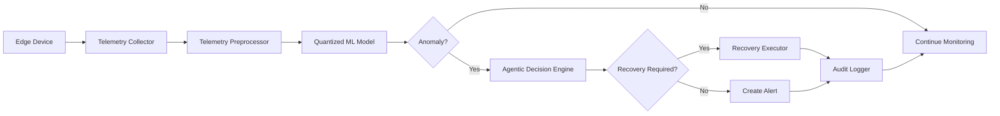

---

#  Core Idea

EdgeGuard consists of four major layers:

| Layer               | Responsibility                          |
| ------------------- | --------------------------------------- |
| **Telemetry Layer** | Collect system metrics, logs and events |
| **AI Layer**        | Detect abnormal system behavior locally |
| **Agent Layer**     | Decide what action should be taken      |
| **Recovery Layer**  | Execute safe remediation actions        |

The architecture is designed so that **AI inference does not require a permanent cloud connection**.

---

#  System Architecture

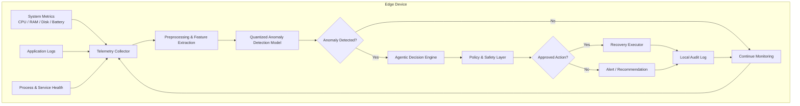

---

#  End-to-End Workflow

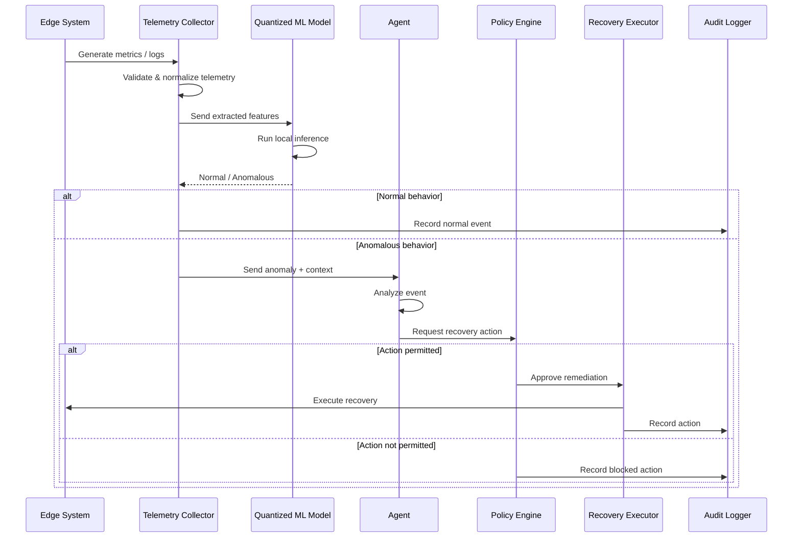

---

#  Major Components

## 1. Telemetry Collector

Responsible for collecting local system information.

Potential telemetry sources:

```text
CPU utilization
Memory utilization
Disk utilization
Battery state
Network state
Process status
Service status
Application logs
Error events
Warning events
```

The collector converts raw information into a consistent internal telemetry format.

Example:

```json
{
  "timestamp": "2026-09-18T12:00:00Z",
  "cpu_usage": 87.4,
  "memory_usage": 91.2,
  "disk_usage": 74.8,
  "network_status": "connected",
  "process_failures": 3,
  "error_count": 12
}
```

---

# 2. Telemetry Preprocessor

Raw telemetry is transformed into features that can be consumed by the ML model.

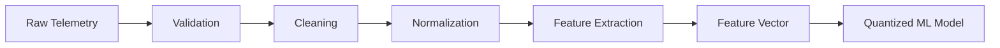

Possible features include:

* CPU utilization
* Memory utilization
* Disk utilization
* Error frequency
* Process failure count
* Network availability
* Resource utilization trend
* Event frequency

---

# 3. On-Device Anomaly Detection

The AI component identifies abnormal system behavior.

The initial implementation can compare:

### FP32 Baseline

```text
Original model
      ↓
FP32 inference
      ↓
Accuracy / latency baseline
```

against:

### INT8 PTQ

```text
FP32 model
      ↓
Calibration
      ↓
INT8 PTQ
      ↓
Edge inference
```

and:

### INT8 QAT

```text
FP32 model
      ↓
Fake quantization
      ↓
Quantization-aware training
      ↓
INT8 model
      ↓
Edge inference
```

---

#  Quantization Strategy

EdgeGuard will investigate whether model quantization can reduce the computational and memory requirements of local anomaly detection.

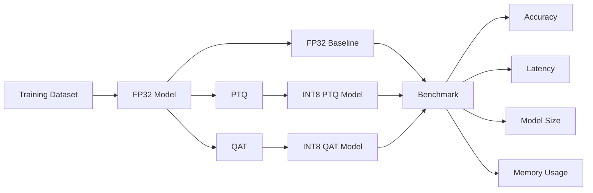

### Benchmark Metrics

The experiment will measure:

| Metric            | FP32 | INT8 PTQ | INT8 QAT |
| ----------------- | ---: | -------: | -------: |
| Model Size        |  TBD |      TBD |      TBD |
| Inference Latency |  TBD |      TBD |      TBD |
| Peak Memory       |  TBD |      TBD |      TBD |
| Accuracy          |  TBD |      TBD |      TBD |
| F1 Score          |  TBD |      TBD |      TBD |
| CPU Utilization   |  TBD |      TBD |      TBD |

> **Note:** Results will be populated using actual measurements from the implementation. No estimated performance numbers are reported.

---

#  Agentic Decision Layer

The anomaly detector answers:

> **"Is something abnormal happening?"**

The agent answers:

> **"What should we do about it?"**

Example workflow:

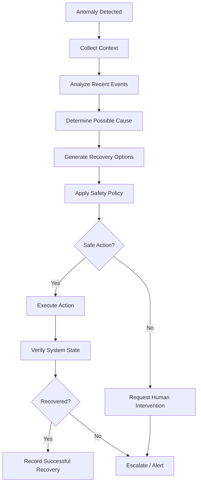

---

# 🛠️ Example Recovery Actions

The prototype can begin with a controlled set of safe actions.

### Example

| Detected Condition          | Possible Action               |
| --------------------------- | ----------------------------- |
| High memory usage           | Restart selected test service |
| Failed test process         | Restart process               |
| Temporary application error | Retry operation               |
| Log queue corruption        | Recreate test queue           |
| Disk threshold exceeded     | Trigger cleanup workflow      |
| Repeated failure            | Generate alert                |

> Recovery actions should initially operate inside a controlled test environment rather than modifying critical host services.

---

#  Safety Layer

Autonomous recovery should not blindly execute arbitrary commands.

EdgeGuard therefore introduces a **Policy & Safety Layer**.

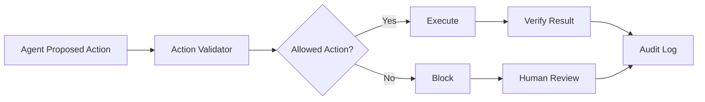

The safety layer can enforce:

* Allowlisted actions
* Resource limits
* Maximum retry count
* Cooldown periods
* Human approval for sensitive operations
* Complete action logging

---

#  Observability Dashboard

EdgeGuard will provide a local dashboard showing:

### System Health

```text
CPU
Memory
Disk
Network
Process Health
```

### AI Status

```text
Model
Precision
Inference Latency
Anomaly Score
Detection Result
```

### Agent Status

```text
Current Event
Decision
Proposed Action
Action Status
Recovery Result
```

Example dashboard flow:

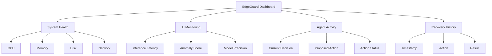

---

#  Privacy-First Design

EdgeGuard follows an **edge-first data processing model**.

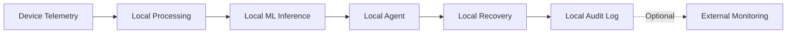

The core detection and recovery workflow does not depend on continuously sending raw telemetry to a remote server.

This can be useful for:

* Edge computing
* Industrial environments
* Remote deployments
* Privacy-sensitive systems
* Intermittently connected devices

---

#  Offline-First Architecture

A key design goal is continued operation when the network is unavailable.

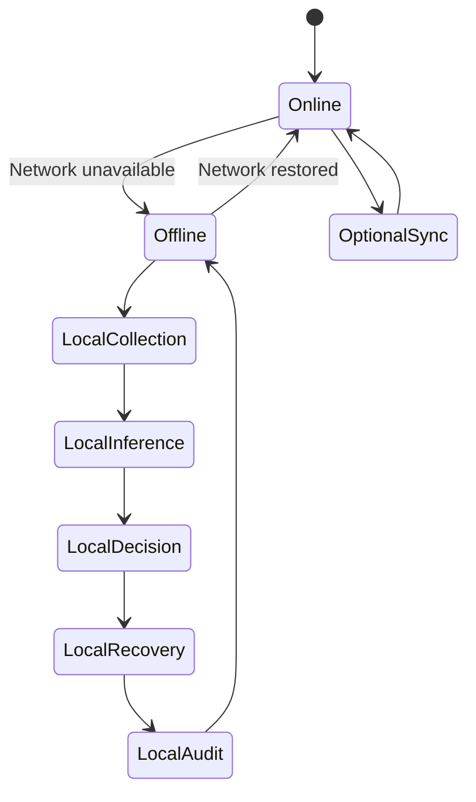

The system should continue collecting, detecting, deciding, and recovering locally during an outage.

---

#  Proposed Repository Structure

```text
edgeguard-agentic-telemetry/
│
├── README.md
├── LICENSE
├── .gitignore
├── requirements.txt
├── package.json
│
├── data/
│   ├── raw/
│   ├── processed/
│   └── README.md
│
├── ml/
│   ├── models/
│   ├── training/
│   ├── quantization/
│   │   ├── ptq/
│   │   └── qat/
│   ├── inference/
│   └── evaluation/
│
├── telemetry/
│   ├── collector/
│   ├── preprocessing/
│   └── schemas/
│
├── agent/
│   ├── planner/
│   ├── policies/
│   ├── tools/
│   └── executor/
│
├── dashboard/
│
├── recovery/
│   ├── actions/
│   └── verification/
│
├── tests/
│
├── benchmarks/
│
├── docs/
│   ├── architecture/
│   ├── experiments/
│   └── demo/
│
└── scripts/
```

---

#  Experimental Methodology

The project will be developed in incremental stages.

## Phase 1 — Telemetry

Build a reliable local telemetry collector.

```text
System
  ↓
Collector
  ↓
Structured Events
  ↓
Local Storage
```

---

## Phase 2 — Dataset

Generate or collect telemetry representing normal and abnormal system states.

```text
Normal Behavior
        +
Synthetic Fault Scenarios
        ↓
Telemetry Dataset
        ↓
Feature Engineering
```

---

## Phase 3 — ML Baseline

Train a lightweight anomaly detection model.

Start with a small architecture that is practical for edge deployment.

Measure:

* Accuracy
* Precision
* Recall
* F1
* Inference latency
* Memory usage

---

## Phase 4 — Quantization

Compare:

```text
FP32
 │
 ├── PTQ → INT8
 │
 └── QAT → INT8
```

The goal is to understand the trade-off between:

**Model quality ↔ Model size ↔ Latency ↔ Memory**

---

## Phase 5 — Agent

Connect anomaly detection to the decision layer.

```text
Telemetry
    ↓
Anomaly
    ↓
Context
    ↓
Agent
    ↓
Policy
    ↓
Action
```

---

## Phase 6 — Self-Healing

Implement a small set of controlled recovery actions.

Every action should produce:

```json
{
  "timestamp": "2026-09-18T12:00:00Z",
  "event": "memory_pressure",
  "decision": "restart_test_service",
  "status": "success"
}
```

---

#  Evaluation

EdgeGuard will be evaluated across four dimensions.

## 1. AI Performance

* Accuracy
* Precision
* Recall
* F1 Score
* False-positive rate

## 2. Edge Performance

* Inference latency
* Memory consumption
* CPU utilization
* Model size

## 3. System Performance

* Detection-to-action latency
* Recovery success rate
* False recovery rate
* Offline operation

## 4. Reliability

* Recovery verification
* Failure escalation
* Audit completeness
* Safety-policy enforcement

---

#  Final Benchmark Table

The final results will be added after experimentation.

| Metric             | FP32 | INT8 PTQ | INT8 QAT | Snapdragon Target |
| ------------------ | ---: | -------: | -------: | ----------------: |
| Model Size         |  TBD |      TBD |      TBD |               TBD |
| RAM Usage          |  TBD |      TBD |      TBD |               TBD |
| Inference Latency  |  TBD |      TBD |      TBD |               TBD |
| Accuracy           |  TBD |      TBD |      TBD |               TBD |
| F1 Score           |  TBD |      TBD |      TBD |               TBD |
| CPU Usage          |  TBD |      TBD |      TBD |               TBD |
| Energy / Inference |  TBD |      TBD |      TBD |               TBD |

---

#  Development Environment

Initial development can be performed on a conventional x86 development machine.

Example environment:

```text
OS              : Windows / Linux
Development     : Python + Node.js
ML              : PyTorch
Model Export    : ONNX / LiteRT / ONNX Runtime
Containerization: Docker
Monitoring      : Prometheus / Grafana
Logging         : Structured JSON Logs
Agent           : Python / Node.js
```

The architecture is intentionally designed to separate **development hardware** from the eventual **edge deployment target**.

---

#  Installation

Clone the repository:

```bash
git clone https://github.com/yakshithkd23/edgeguard-agentic-telemetry.git

cd edgeguard-agentic-telemetry
```

Create a Python environment:

```bash
python -m venv .venv
```

Activate it on Windows:

```powershell
.venv\Scripts\activate
```

Install dependencies:

```bash
pip install -r requirements.txt
```

Install Node.js dependencies if the agent layer uses Node.js:

```bash
npm install
```

---

# ▶ Planned Execution Flow

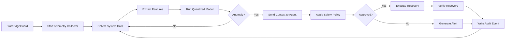

---

#  Competition Demonstration

The final demonstration will focus on a complete edge AI workflow:

### Demo Scenario

```text
1. Start EdgeGuard
        ↓
2. System operates normally
        ↓
3. Introduce controlled abnormal condition
        ↓
4. Telemetry collector detects change
        ↓
5. Quantized ML model detects anomaly
        ↓
6. Agent analyzes the event
        ↓
7. Safety policy validates recovery
        ↓
8. Recovery action executes
        ↓
9. System health is verified
        ↓
10. Complete event appears in dashboard
```

---

#  Key Differentiators

EdgeGuard combines several technologies into a single edge-oriented workflow:

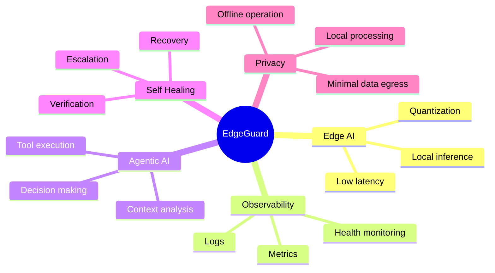

---

#  Future Work

Potential future extensions include:

* Snapdragon NPU acceleration
* Hardware-aware model optimization
* INT4 / mixed-precision experimentation
* Energy-aware inference
* TinyML deployment
* Federated anomaly learning
* More advanced agent planning
* Human-in-the-loop recovery
* Secure remote fleet management
* Edge-device fleet observability

---

#  Current Status

```text
[ ] Telemetry Collector
[ ] Dataset Generation
[ ] Baseline ML Model
[ ] PTQ Implementation
[ ] QAT Implementation
[ ] Edge Inference
[ ] Agent Decision Layer
[ ] Safety Policy
[ ] Recovery Executor
[ ] Dashboard
[ ] Benchmarking
[ ] End-to-End Demo
```


